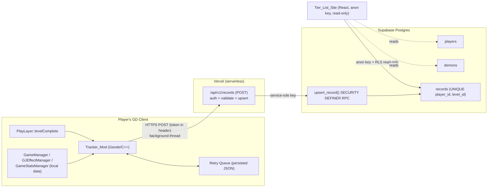
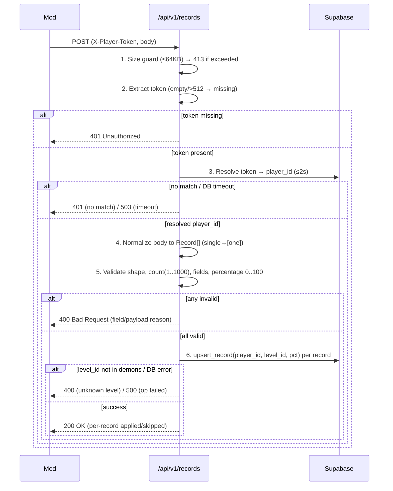
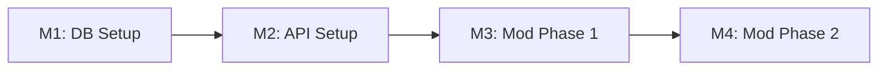

# Design Document: Demon Tier Tracker

## Overview

The Demon Tier Tracker collects Geometry Dash demon-completion data from a closed
community (~20 players) and renders it as a public demon tier list. This design
realizes the four components defined in the requirements:

1. **Tracker_Mod** — a Geode (C++) mod that reads local completion data and reports it.
2. **Records_API** — Vercel serverless functions that authenticate, validate, and upsert records.
3. **Database** — Supabase Postgres (`players`, `demons`, `records`).
4. **Tier_List_Site** — the existing React 19 + TypeScript + Vite app, reading via a read-only path.

The dominant engineering constraints are: (a) **correctness of the higher-only upsert**
under concurrency and repeated submissions (Req 7), (b) **server-authoritative attribution**
that ignores client-supplied identity (Req 10.1), and (c) **zero gameplay impact** for the mod
(Req 3, ≤1 ms main-thread budget). Everything else is conventional CRUD and rendering.

### Tech Stack Recommendation

| Concern | Recommendation | Rationale |
|---|---|---|
| Backend runtime | **Vercel Serverless Functions (Node.js 20, TypeScript)** under `/api/v1/*` | Repo already deploys to Vercel; no servers to maintain; scales trivially at 20-player volume; functions sleep at zero cost. |
| Database | **Supabase Postgres** (already integrated) | `@supabase/supabase-js` is already a dependency; gives us a managed Postgres with `ON CONFLICT` upserts, `CHECK`/`UNIQUE` constraints, RLS, and SQL RPCs. Zero maintenance on the free/pro tier for this scale. |
| Server→DB access | **Supabase service-role key** (server-only env var) | Bypasses RLS for authoritative writes inside the trusted serverless boundary. |
| Site→DB access | **Supabase anon key + RLS read-only policy** (or a read-only view) | Public read path that physically cannot write (Req 10.5). |
| Mod language | **C++ with the Geode SDK** | Required by the runtime (mod loads inside the GD client). Networking via Geode's `web::WebRequest` (built on a background thread). |
| Mod persistence | **Geode `Mod::get()->setSavedValue` / mod save dir JSON** | Persists token, sync flag, and retry queue across launches (Req 2.6, 4.2). |

**Decision — single backend, no separate API server.** A standalone Node/Express service was
considered but rejected: it would add a host to maintain and monitor, contradicting the
"zero maintenance at 20-player scale" goal. Vercel functions cover the entire surface.

### Conventions for Goal Reuse vs. New Build

Two existing pieces of the repo intersect this feature and must be reconciled deliberately
(detailed in Data Models):

- The existing `profiles` table already carries a `gd_username`. The tracker, however, needs a
  table keyed by a secret token with no dependency on the website auth lifecycle. This design
  introduces a **separate `players` table** rather than overloading `profiles`.
- `vercel.json` currently rewrites all non-`.well-known` paths to `index.html`. The design adds
  an explicit `/api` carve-out so serverless routes are not swallowed by the SPA fallback.

## Architecture



### Request Lifecycle (Records_API)



Validation is **all-or-nothing per request** (Req 6.4, 6.5, 10.3): the API validates every
record before any write, so a single bad record rejects the whole batch with no persistence.

### Vercel Routing Change

`vercel.json` must stop rewriting `/api/*` to the SPA. Updated rewrite source:

```json
{ "source": "/((?!api/|\\.well-known/).*)", "destination": "/index.html" }
```

Functions live at `/api/v1/records.ts`, addressed as `POST /api/v1/records`.

## Components and Interfaces

### Component 1: Tracker_Mod (Geode / C++)

Responsibilities: read local completions, manage the session sync flag, evaluate live events,
queue and retry, and perform all networking off the main thread.

#### Geode Hook Strategy

**Phase 1 — Initial Sync (Req 1).** Hook the post-load menu entry so local save data is fully
parsed before reading:

- Hook **`MenuLayer::init`** (via Geode's `$modify` macro). On first invocation per session, if a
  token is configured and the sync flag is unset, spawn a background read of local completions.
- Source the per-level completion percentages from the local stats. In current GD,
  per-level normal/practice percent is stored in `GameStatsManager` (a.k.a. the
  level-progress store accessed through `GameManager::sharedState()`), with online-level
  metadata cached in `GameLevelManager`. The mod reads, for each known demon level:
  `levelID`, `levelName`, and the stored best **normal-mode percent**.
- `GJEffectManager` is **not** a data source for completion percent; it is listed in the
  requirements brief only as a candidate and is explicitly ruled out here — it manages visual
  effect/trigger state, not save progress. The authoritative read path is
  `GameManager` → `GameStatsManager` percent store + `GameLevelManager` for names.
- Reads execute on a worker thread; only the cheap "should I sync?" flag check touches the
  main thread (Req 3.1).

**Phase 2 — Live Tracking (Req 2).** Hook the completion/award path:

- Hook **`PlayLayer::levelComplete`** for full completions (100%).
- Hook **`PlayLayer::destroyPlayer`** (or the engine's percent-update path) to capture new-best
  **partial** percentages, comparing against the last reported value held in mod memory.
- On a qualifying higher-only event, enqueue a single Record and trigger an async POST. The hook
  body does O(1) work (compare + enqueue) to honor the ≤1 ms budget; the network call is dispatched
  to Geode's `web::WebRequest` which runs on its own thread (Req 3.1, 3.2).

#### Networking, Queue, and Persistence

- **Transport:** Geode `web::WebRequest` (libcurl-backed, background thread). Timeouts:
  live POST 10 s for success-confirmation (Req 2.6), hard cancel at 30 s (Req 3.3),
  up to 3 connection retries (Req 3.5).
- **Retry queue:** an in-memory map `level_id → Record`, capped at **one entry per level_id**
  holding the highest percentage (Req 2.8). Persisted as JSON in the mod save dir on change so it
  survives launches (Req 2.6). On confirmation, the entry is removed (Req 2.7).
- **Session flag:** `initial_sync_done` is a per-session boolean, set only on a 200 within 30 s
  (Req 1.6); left unset on failure to force retry next launch (Req 1.8). Live submissions are
  withheld while unset (Req 2.5).
- **Config:** a Geode settings field for the token (1–256 chars), rejecting empty/whitespace
  saves and retaining the prior value (Req 4.1–4.3). The token is attached to every request
  (Req 4.4); requests are aborted with a notice if no token is set (Req 4.5).

### Component 2: Records_API (`POST /api/v1/records`)

A single TypeScript serverless function. Reads the token from the **`X-Player-Token`** header
(not the body, reinforcing attribution-by-token, Req 10.1).

#### API Payload Specification

**Authentication header (all requests):**
```
X-Player-Token: <secret token, 1..512 chars>
Content-Type: application/json
```

**Phase 1 — Initial Bulk Sync.** Body is a JSON **array** of 1..1000 records (Req 6.2). The mod
may collect up to 100,000 local completions (Req 1.4) but MUST chunk into batches of ≤1000 and
≤64 KB per request (Req 6.2, 10.4):
```json
[
  { "level_id": "128", "level_name": "Theory of Everything 2", "percentage": 100 },
  { "level_id": "9876543", "level_name": "Some Demon", "percentage": 87 },
  { "level_id": "44622744", "level_name": "Tartarus", "percentage": 41 }
]
```

**Phase 2 — Live Single Update.** Body is a single JSON **object** (Req 6.1):
```json
{ "level_id": "44622744", "level_name": "Tartarus", "percentage": 73 }
```

**Field rules (both shapes):**
- `level_id` (string, required, non-empty) — GD numeric level id as a string; must exist in
  `demons` (Req 10.3).
- `level_name` (string, 1..255) — used only for Phase 1 demon bootstrapping/labeling; ignored for
  attribution.
- `percentage` (number, required, 0..100 inclusive) (Req 6.3).
- Any `player_id` present in the body is **ignored**; attribution is by token only (Req 10.1).

**Success response (HTTP 200, Req 6.6):**
```json
{
  "status": "ok",
  "processed": 3,
  "results": [
    { "level_id": "128",      "applied": false, "reason": "not_higher", "stored_percentage": 100 },
    { "level_id": "9876543",  "applied": true,  "stored_percentage": 87 },
    { "level_id": "44622744", "applied": true,  "stored_percentage": 41 }
  ]
}
```

**Error responses:**
```json
// 401 Unauthorized (missing/unknown token) — Req 5.4, 5.5, 5.7, 10.2
{ "status": "error", "code": "unauthorized", "message": "Invalid or missing player token" }

// 400 Bad Request (validation) — Req 6.4, 6.5, 10.3
{ "status": "error", "code": "invalid_payload", "message": "percentage must be 0..100", "field": "percentage", "index": 1 }
{ "status": "error", "code": "unknown_level", "message": "level_id not in demons", "field": "level_id", "index": 2 }

// 413 Payload Too Large — Req 10.4
{ "status": "error", "code": "payload_too_large", "message": "Body exceeds 64KB" }

// 503 Service Unavailable (auth could not complete) — Req 5.6
{ "status": "error", "code": "auth_unavailable", "message": "Could not validate token in time" }

// 500 (DB write failed) — Req 7.7
{ "status": "error", "code": "persist_failed", "message": "Record could not be stored" }
```

### Component 3: Tier_List_Site (React)

A new route/page in the existing app. Uses the existing `supabase` anon client (read-only via
RLS, Req 10.5). Fetches demons grouped by tier and their records ordered by percentage desc then
player name asc (Req 9.1, 9.3, 9.5). Renders a 100% badge (Req 9.6) and per-demon empty states
(Req 9.2, 9.4). Data reflects committed state at page-load time (Req 9.8). A `recommended` query
shape is a single join read or a `tier_list_view`.

## Data Models

### Reconciliation: `players` vs. existing `profiles`

The existing `profiles` table is tied to the website's Supabase Auth user lifecycle and already
holds a `gd_username`. The tracker needs identities that:
- are keyed by a **secret token** rather than an auth session,
- can exist for players who never log into the website, and
- carry no PII coupling to the auth flow.

**Decision: introduce a dedicated `players` table** (per Req 8.1) rather than extending
`profiles`. An optional nullable `profile_id` FK links a player to a website profile when one
exists, without making the tracker depend on the auth system. This keeps the anti-cheat token
surface isolated and avoids RLS entanglement with auth-owned rows.

**Token storage decision.** Req 5.3/8.1 require validating an incoming token against stored
players and storing a "non-empty Secret_Player_Token." Because the API must *look up* a player by
the raw token on every request, the token functions like a bearer credential. Recommendation:
store a **SHA-256 hash** of the token (`token_hash`) with a `UNIQUE` constraint, and look up by
hashing the incoming token, never storing plaintext. This protects tokens at rest if the DB is
exposed while preserving O(1) indexed lookup (a salted/bcrypt scheme would prevent indexed lookup
at acceptable cost; a single SHA-256 over a high-entropy ≥128-bit random token is appropriate
here). Tokens are generated server-side/admin-side as ≥32-char random strings.

### Entity-Relationship Diagram

```mermaid
erDiagram
  players ||--o{ records : "has"
  demons  ||--o{ records : "ranked in"
  profiles ||--o| players : "optional link"

  players {
    uuid        id PK
    text        username UK "1..255, NOT NULL"
    text        token_hash UK "SHA-256 of secret token, NOT NULL"
    uuid        profile_id FK "nullable → profiles.id"
    timestamptz created_at "UTC, default now()"
  }
  demons {
    text        level_id PK "GD numeric id as text, NOT NULL"
    text        name "1..255, NOT NULL"
    text        difficulty_tier "enum-checked, NOT NULL"
    timestamptz created_at "UTC, default now()"
  }
  records {
    uuid        id PK
    uuid        player_id FK "→ players.id, NOT NULL"
    text        level_id FK "→ demons.level_id, NOT NULL"
    numeric     percentage "0.00..100.00, NOT NULL"
    timestamptz updated_at "UTC"
    "UNIQUE"    uq "(player_id, level_id)"
  }
```

### Table definitions (DDL intent)

```sql
-- players (Req 8.1)
create table players (
  id          uuid primary key default gen_random_uuid(),
  username    text not null unique check (char_length(username) between 1 and 255),
  token_hash  text not null unique,                 -- SHA-256 hex of secret token
  profile_id  uuid references profiles(id),         -- optional link, nullable
  created_at  timestamptz not null default now()    -- UTC
);

-- demons (Req 8.2)
create type difficulty_tier as enum
  ('easy','medium','hard','insane','extreme','legendary','mythic'); -- predefined set
create table demons (
  level_id        text primary key check (char_length(level_id) >= 1),
  name            text not null check (char_length(name) between 1 and 255),
  difficulty_tier difficulty_tier not null,
  created_at      timestamptz not null default now()
);

-- records (Req 8.3, 8.5, 8.6, 7.5)
create table records (
  id          uuid primary key default gen_random_uuid(),
  player_id   uuid not null references players(id),
  level_id    text not null references demons(level_id),
  percentage  numeric(5,2) not null check (percentage >= 0 and percentage <= 100),
  updated_at  timestamptz not null default now(),
  unique (player_id, level_id)                       -- Req 7.5
);
```

### Atomic Higher-Only Upsert (Req 7.1, 7.2, 7.3, 7.6)

The upsert is the correctness core. It must be atomic under concurrent serverless instances and
idempotent. Implemented as a single statement using the composite unique constraint:

```sql
insert into records (player_id, level_id, percentage, updated_at)
values ($1, $2, $3, now())
on conflict (player_id, level_id) do update
  set percentage = excluded.percentage,
      updated_at = now()
  where excluded.percentage > records.percentage   -- higher-only guard
returning percentage, (xmax = 0) as inserted;
```

Wrapped in a `SECURITY DEFINER` RPC `upsert_record(p_player_id, p_level_id, p_percentage)` so the
API calls it with the service role and the level-existence FK is enforced by Postgres. The
`WHERE excluded.percentage > records.percentage` clause makes equal-or-lower submissions a no-op
(Req 7.3), and the single-statement `ON CONFLICT` is atomic per row, giving idempotency and the
correct max under concurrency (Req 7.6). A missing `demons` row raises a FK violation the API maps
to 400 `unknown_level` (Req 10.3). The RPC returns whether a row was inserted/updated so the API
can report `applied` per record.

### RLS Strategy

- `records`, `players`, `demons`: enable RLS.
- **Public read policy** for the site: `SELECT` allowed for the `anon` role on `demons`, `records`,
  and a non-sensitive projection of `players` (`id`, `username`) — never `token_hash`. A
  `tier_list_view` exposing only `username` + percentages is the cleanest read surface (Req 10.5).
- **No** anon `INSERT/UPDATE/DELETE` policies exist, so the public path physically cannot write.
- The API uses the **service-role key** (server-only env var `SUPABASE_SERVICE_ROLE_KEY`), which
  bypasses RLS for authoritative writes through the RPC.

### Security & Anti-Cheat Plan

**Threat model honesty.** The Tracker_Mod reads values out of the local GD process. A determined
user can edit their own client's memory or craft requests with their own valid token. **Client-side
RAM reads are inherently spoofable** — no client mod can prove a percentage was earned legitimately.
This system targets a *trusted ~20-person community*, so the goal is to prevent **casual tampering
and accidental corruption**, not to defeat a determined insider.

Enforceable server-side (in scope):

| Control | Mechanism | Requirement |
|---|---|---|
| Identity spoofing in payload | Attribution by validated token only; body `player_id` ignored | 10.1 |
| Unknown/forged accounts | Token must hash-match a `players` row, else 401 | 5.5, 10.2 |
| Out-of-range scores | `CHECK (0..100)` + API validation, reject batch | 6.3, 6.4, 7.4 |
| Fake/unknown levels | FK to `demons` + allow-listing, reject with 400 | 10.3 |
| Oversized/DoS payloads | 64 KB size guard → 413; batch cap 1000 | 10.4, 6.5 |
| Score regression / dup spam | Higher-only atomic upsert; idempotent | 7.2, 7.3, 7.6 |
| Public write via site | RLS read-only; service-role confined to server | 10.5 |
| Token interception | HTTPS only; token in header; stored hashed at rest | 5.x, 8.1 |

Out of scope (documented, not solved): a player inflating their *own* percentages via memory
editing. Mitigations available to admins are social/manual (the small community can spot
implausible results and rotate/revoke a token by deleting the `players` row, which 401s all
future submissions).

### Step-by-Step Implementation Roadmap



- **Milestone 1 — Database (Req 8, 7.5, 10.5).** Apply migrations via Supabase MCP: create
  `difficulty_tier` enum, `players`, `demons`, `records` with constraints and the `(player_id,
  level_id)` unique index; create `upsert_record` SECURITY DEFINER RPC; enable RLS with anon
  read-only policies and `tier_list_view`; seed the demons allow-list.
- **Milestone 2 — Records_API (Req 5, 6, 7, 10).** Add `/api/v1/records.ts`; carve `/api` out of
  the SPA rewrite in `vercel.json`; implement size guard → token extract/hash/lookup → payload
  normalize → validate → per-record RPC upsert → response mapping. Wire `SUPABASE_SERVICE_ROLE_KEY`.
- **Milestone 3 — Mod Phase 1 / Initial Sync (Req 1, 3, 4).** Geode project: token settings field,
  `MenuLayer::init` hook, background read of `GameStatsManager`/`GameLevelManager` completions,
  validation/skip, JSON batching (≤1000/≤64 KB), POST with header, session flag on success.
- **Milestone 4 — Mod Phase 2 / Live Tracking (Req 2, 3).** Hook `PlayLayer::levelComplete` and
  the percent-update path; in-memory last-reported map; higher-only gating; persisted retry queue
  (one-per-level, highest pct); confirmation-based dequeue; full async/timeout/retry handling.
  Site tier-list page (Req 9) is built alongside M1–M2 once data exists.

## Correctness Properties

*A property is a characteristic or behavior that should hold true across all valid
executions of a system — essentially, a formal statement about what the system should do.
Properties serve as the bridge between human-readable specifications and machine-verifiable
correctness guarantees.*

The following properties were derived from the prework analysis. Acceptance criteria that
describe networking/timing, threading performance, live engine memory reads, UI branch states,
or one-off schema constraints are validated by integration, example, or constraint tests
(see Testing Strategy) rather than property-based tests.

### Property 1: Monotonic, idempotent, confluent upsert

*For any* player, level_id, and any (possibly empty, possibly duplicated) multiset of submitted
percentages in any processing order, after all submissions the database holds **exactly one**
record for that (player, level_id), and its stored percentage equals the **maximum** submitted
percentage; submitting an equal-or-lower percentage leaves the stored value unchanged.

**Validates: Requirements 7.1, 7.2, 7.3, 7.5, 7.6, 6.6**

### Property 2: Payload normalization equivalence

*For any* valid record object `r`, processing the single-object payload `r` produces the same
stored result as processing the singleton array `[r]`; and *for any* valid array of 1..1000
records, every record is processed in the order received.

**Validates: Requirements 6.1, 6.2**

### Property 3: All-or-nothing validation

*For any* request payload, the request is accepted only if every record has a non-empty
`level_id` and a numeric `percentage` in [0, 100]; if any record is missing a required field,
has a non-numeric percentage, or a percentage outside [0, 100], the entire request is rejected
with HTTP 400, names the offending field, and persists no record.

**Validates: Requirements 6.3, 6.4, 7.4**

### Property 4: Authentication rejection persists nothing

*For any* request whose token is missing, empty, longer than 512 characters, or does not
hash-match a stored player, the Records_API returns HTTP 401 and persists no data, regardless of
payload contents or how far processing progressed.

**Validates: Requirements 5.2, 5.4, 5.5, 5.7, 10.2**

### Property 5: Attribution invariance

*For any* authenticated request and *any* `player_id` value supplied in the payload (including
a forged or another player's id, or none), every persisted record is attributed to the player
identified by the validated token and never to the payload-supplied id.

**Validates: Requirements 10.1**

### Property 6: Level allow-listing

*For any* request containing a record whose `level_id` is not present in the `demons` table, the
Records_API rejects the request with HTTP 400 and persists no record from that request.

**Validates: Requirements 10.3**

### Property 7: Payload size guard

*For any* request body, if its size exceeds 64 kilobytes the Records_API returns HTTP 413 and
persists no data; otherwise the size guard admits it for further processing.

**Validates: Requirements 10.4**

### Property 8: Public read path is write-incapable

*For any* insert, update, or delete attempted through the site's anon read path, the operation is
denied and the stored data is unchanged.

**Validates: Requirements 10.5**

### Property 9: Local completion filtering

*For any* collection of raw local completions (mixing valid entries with entries missing a
level_id, name, or percentage, or with a percentage outside 0..100), the upload set contains
exactly the valid completions and the recorded skipped count equals the number of invalid ones.

**Validates: Requirements 1.3**

### Property 10: Completion serialization round-trip

*For any* list of valid completions (including the empty list), serializing the list to the JSON
array and parsing it back yields an equivalent list of completions.

**Validates: Requirements 1.4**

### Property 11: Higher-only live gating

*For any* last-reported value (including "none") and any new observed percentage, the Tracker_Mod
emits a submission for that level if and only if the new percentage is strictly greater than the
last-reported value (with "none" treated as lower than any value).

**Validates: Requirements 2.2, 2.3, 2.4**

### Property 12: Retry queue keeps one highest entry per level

*For any* sequence of enqueue operations followed by confirmations, the retry queue contains at
most one entry per level_id, each entry's percentage equals the maximum percentage enqueued for
that level since its last confirmation, and confirmed level_ids are absent from the queue.

**Validates: Requirements 2.7, 2.8**

### Property 13: Whitespace token rejection

*For any* string consisting solely of whitespace (or empty), saving it as the token is rejected
and the previously persisted token is retained unchanged.

**Validates: Requirements 4.3**

### Property 14: Tier list ordering

*For any* set of demon records, the rendered records for each demon are ordered by percentage
descending, with ties broken alphabetically (ascending) by player name, and each rendered record
shows its player together with an integer percentage in 0..100.

**Validates: Requirements 9.3, 9.5**

### Property 15: Difficulty group ordering

*For any* set of demons, the rendered tier groups appear in order from highest difficulty to
lowest difficulty.

**Validates: Requirements 9.1**

### Property 16: Hundred-percent indicator

*For any* rendered record, the 100% visual indicator is present if and only if the record's
percentage equals 100.

**Validates: Requirements 9.6**

## Error Handling

| Condition | Component | Behavior | Status / Effect | Requirement |
|---|---|---|---|---|
| Body > 64 KB | API | Reject before parse | 413, no write | 10.4 |
| Missing/empty/>512 token | API | Treat as missing, reject | 401, no write | 5.2, 5.4, 5.7 |
| Token no match | API | Reject | 401, no write | 5.5, 10.2 |
| DB unreachable / auth >2s | API | Service unavailable | 503, no write | 5.6 |
| Bad shape / empty / >1000 array | API | Reject | 400, no write | 6.5 |
| Invalid field/percentage in any record | API | Reject whole batch | 400 + field name, no write | 6.4, 7.4 |
| level_id not in demons (FK) | API | Reject whole request | 400, no write | 10.3, 8.6 |
| Upsert/DB write fails | API | Leave prior state | 500, no mutation | 7.7 |
| Unique/constraint violation | DB | Reject write, retain data | error naming constraint | 8.5 |
| Mod request timeout > 30s | Mod | Cancel, log, continue | gameplay unaffected | 3.3 |
| Mod request failure/non-2xx | Mod | Log, continue | gameplay unaffected | 3.4 |
| No connection | Mod | Log, retry ≤3, continue | gameplay unaffected | 3.5 |
| Live POST unconfirmed in 10s | Mod | Queue + persist, retry later | survives launches | 2.6 |
| No token configured | Mod | Abort request, notify | nothing sent | 4.5 |
| Indicator cannot render for 100% | Site | Omit that completion | not shown un-badged | 9.7 |
| No demons / no records | Site | Empty-state messages | informational | 9.2, 9.4 |

All API error responses use the JSON error envelope defined in the API Payload Specification.
The mod treats every networking error as non-fatal: gameplay state is never modified as a side
effect of a failed or slow request (Req 3.3–3.5).

## Testing Strategy

This feature **is suitable for property-based testing** for its pure-logic core: the upsert
algorithm, payload validation/normalization, attribution, mod-side filtering/gating/queueing, and
site ordering are all input-varying functions with universal properties. Infrastructure, threading
performance, live-engine memory reads, and UI branch states are covered by integration/example
tests instead.

### Property-Based Tests

- **Library:** `fast-check` with `vitest` for the TypeScript API and React site (matches the
  repo's ecosystem; Vite/TS already present). For the C++/Geode mod, `rapidcheck` for the pure
  logic (filtering, gating, queue, serialization round-trip).
- **Configuration:** minimum **100 iterations** per property.
- **Tagging:** each property test references its design property with the format
  **Feature: demon-tier-tracker, Property {number}: {property_text}**.
- **Coverage:** implement each of Properties 1–16 with a single property-based test. The API-side
  properties (1–8) run against a Postgres test instance (or the real `upsert_record` RPC) so the
  atomic `ON CONFLICT` semantics are exercised; concurrency for Property 1 is driven by issuing
  randomized permutations and duplicate multisets, including parallel calls, then asserting the
  single-row maximum invariant.
- **Generators / edge cases** (Req 6.5, 8.x, 10.4 boundaries): empty arrays, 1000- and
  1001-element arrays, percentages at 0/100 and just outside, non-numeric percentages, missing
  fields, whitespace-only tokens, tokens at 512/513 chars, payloads straddling 64 KB, forged
  payload `player_id`s, level_ids inside and outside the demons allow-list, and Unicode/long
  level names.

### Example & Edge-Case Unit Tests

- Mod struct→Record mapping (1.2), sync-flag transitions (1.6–1.8, 2.5), token presence wiring
  (4.1, 4.2, 4.4, 4.5), header extraction (5.1), valid-token proceed (5.8), timestamp advance on
  applied upsert (8.4), site empty-state and no-records and indicator-fallback branches (9.2, 9.4,
  9.7).

### Integration Tests (1–3 examples each)

- End-to-end POST through `/api/v1/records` against a Supabase test project: success, 401, 400,
  413, 503 paths (Req 5.3, 5.6, 7.7).
- DB constraint enforcement: unique `(player_id, level_id)`, FK violations, invalid difficulty
  tier (Req 8.1–8.6, 7.5).
- Mod networking against a stub server: 30s cancel, retry-3-on-no-connection, 10s queue-on-timeout
  (Req 3.3–3.5, 2.6).
- RLS: attempt writes with the anon key and assert denial (Req 10.5, complements Property 8).
- Site freshness: change records, reload page, assert updated data (Req 9.8).

### Performance Tests

- Main-thread budget (Req 3.1, 3.2): instrument the hook bodies and assert per-frame overhead
  stays under 1 ms while a request is in flight; assert request initiation stalls the main thread
  for under 1 ms (measured in a GD client build).
